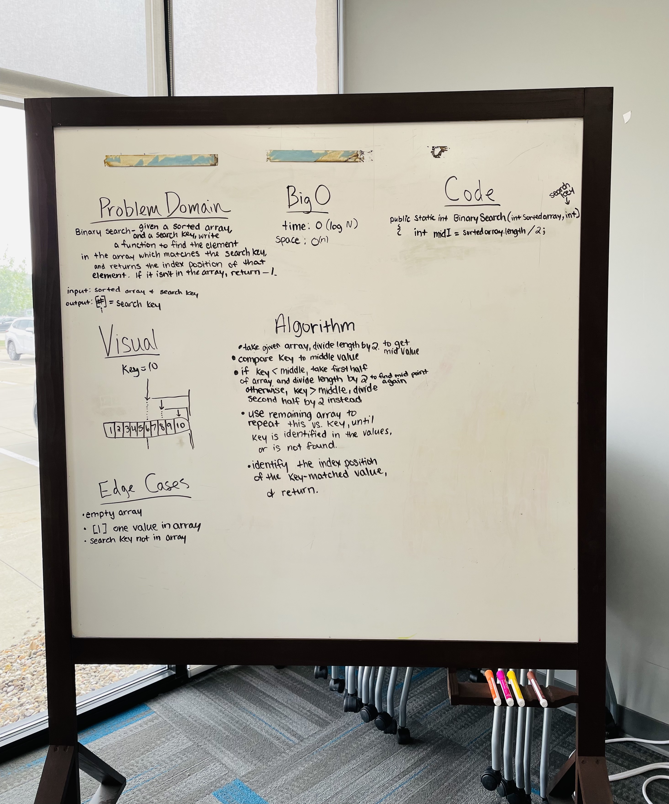

# Array Binary Search

## [DSA Home](https://mistidinzy.github.io/data-structures-and-algorithms/)

---

Write a function called **BinarySearch** which takes in 2 parameters: a sorted array and the search key.

Without utilizing any of the built-in methods available to your language,

**return the index of the array’s element that is equal to the value of the search key, or -1 if the element is not in the array.**

NOTE: The search algorithm used in your function should be a binary search.

---

## Whiteboard Process
<!-- Embedded whiteboard image -->

## Approach & Efficiency

We set a time limit for 50 minutes for this exercise.
We create a method named BinarySearch, which takes in a sorted int array, and a search key as parameters.

We agreed on how the logic process of the method would work,
ie. if key < middleIndex, then compare the key against the first half of the array, and repeat until we match the key.

But we when we came to the Code portion, we were stumped on how we would go about writing out the actual **code** to make it happen.

---

## Resources

[BINARY SEARCH ALGORITHM](https://en.wikipedia.org/wiki/Binary_search_algorithm)

---
