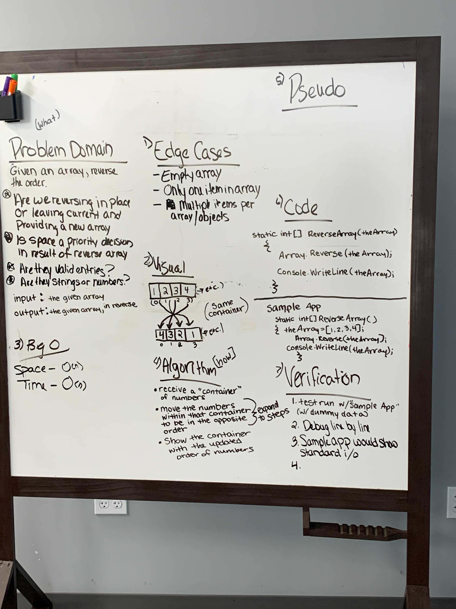

# Reverse an Array

Given an array, return the array in reverse.

## Whiteboard Process

## Approach & Efficiency
<!-- What approach did you take? Discuss Why. What is the Big O space/time for this approach? -->

We talked through what we already knew and what questions we had.

We assumed the array was all numbers.
We used the "Array.Reverse" method in C#, to take the original array and exactly reverse the order of the that array in the same space.  
If we were to do it again, we would not have used the built-in method. We would have used a for loop to move two items at a time.

_____

[Home](/README.md)
