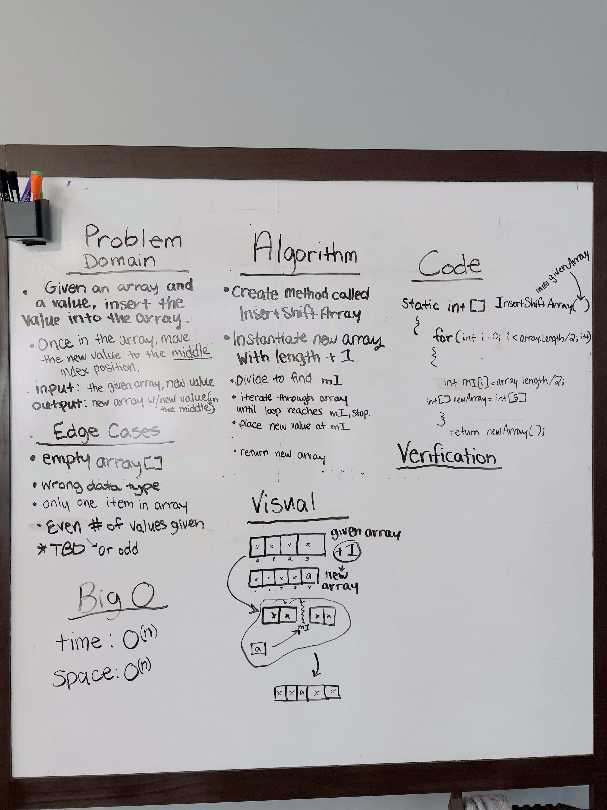

# Insert Shift Array

## [DSA Home](https://mistidinzy.github.io/data-structures-and-algorithms/)

---

Given an array, and a value, write a function that will add that value to the array.
Set the position of the new value to be at the middle index of the array.

## Whiteboard Process
<!-- Embedded whiteboard image -->

## Approach & Efficiency
<!-- What approach did you take? Discuss Why. What is the Big O space/time for this approach? -->

* We create a method called InsertShiftArray.

* We would instantiate a new array with the set length to be +1 more than the length of the given array.

* We divide the length of the array by 2 to find the middle index position.

<!-- * Set counter to [i = 0] ? -->

* Using a For Loop, we would iterate through the array, and tell the counter to stop once it reaches that middle index position.

* Set the position of the new value to be at the middle index position.

* Return the new array.

---
