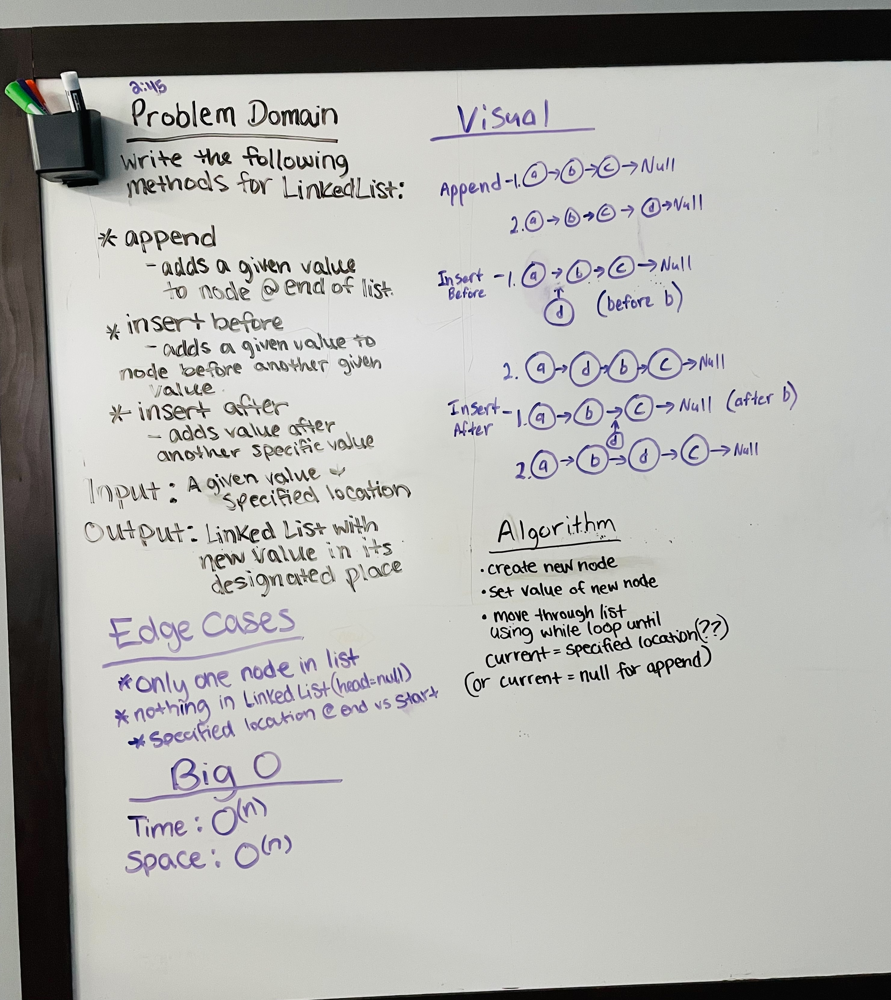

# Linked List Insertions

Extend a Linked List to allow various insertion methods.

Write the following methods for the Linked List class:
_____

append

arguments: new value

adds a new node with the given value to the end of the list

_____

insert before

arguments: value, new value

adds a new node with the given new value immediately before the first node that has the value specified

_____

insert after

arguments: value, new value

adds a new node with the given new value immediately after the first node that has the value specified

_____

