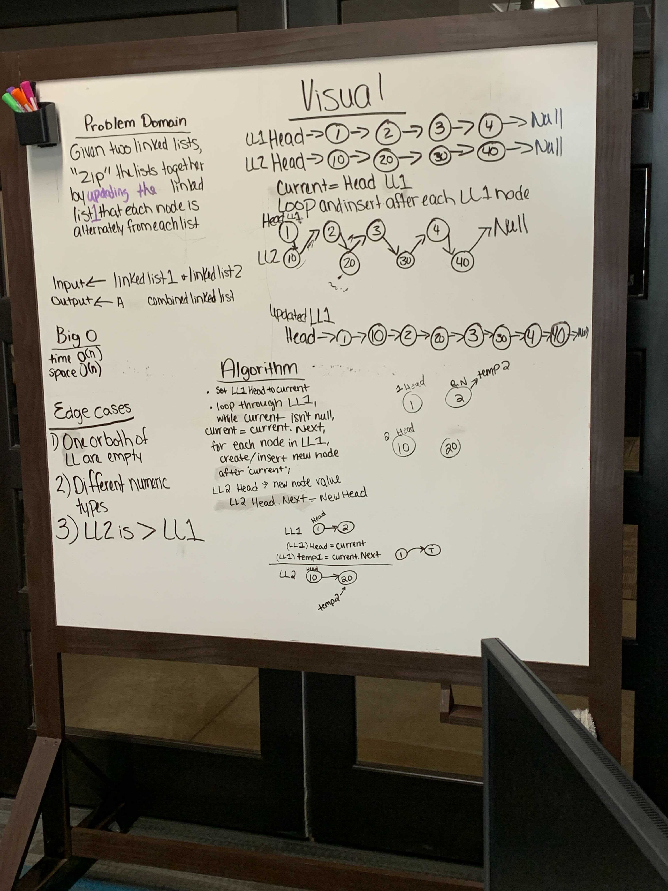

# Linked List Zip

## Problem Domain

Zip two linked lists.

## Feature Tasks

* Write a function called zip lists
* Arguments: Two linked lists
* Return: Linked list, zipped as noted
* Zip the two linked lists together into one, so that the nodes alternate between the two lists, and return a reference to the head of the zipped list.
* Try and keep additional space down to O(1)
* You have access to the Node class and all the properties on the Linked List class as well as the methods created in previous challenges.

### Inputs and Expected Outputs

zipLists(list1, list2)

|   Arg list1  |   Arg list2  | Expected Output |
| :----------- | :----------- | :----------- |
| **head -> [1] -> [3] -> [2] -> X** | **head -> [5] -> [9] -> [4] -> X** | **head -> [1] -> [5] -> [3] -> [9] -> [2] -> [4] -> X** |

### Big O

| Time | Space |
| :----------- | :----------- |
| O(n) | O(n) |

_____

### Whiteboard Visual

_____

## Approach & Efficiency

* Given two linked lists (LL1 & LL2)

* Set LL1-Head to LL1-current

* Assign LL1-Current.Next to temp1 variable

* Set LL2-Head to LL2-current ?
* Assign LL2-Current.Next to temp2 variable

* Point LL1 Head to LL2-Head
* LL2-Head is now LL1-Head.Next

* LL1-Head.Next now points to temp1
* LL2-temp2 becomes LL2's new Head

* Repeat (??)

## Solution

_____

[Home](/README.md)
