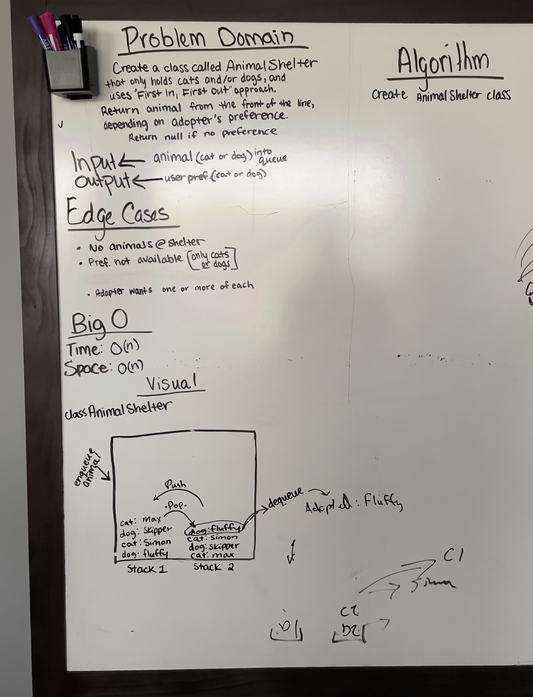

# First In, First Out Animal Shelter

## Problem Domain

Create a class called AnimalShelter, which only holds dogs and cats.

The shelter operates using a First In, First Out approach.

Implement the following methods:

* enqueue
  * Arguments: **animal**
    * **animal** can be a dog or a cat

* dequeue
  * Arguments: **pref**
  * **pref** can be either dog or cat
  * Returns: either a dog or a cat, based on preference (**pref**)
    * returns null if **pref** is not a dog or a cat.

---

## Whiteboard Process

## Approach & Efficiency

Our general idea was to utilize two stacks within the AnimalShelter class.

The animals would be "enqueued" into the first stack as they arrive to the shelter.

When one is going to be adopted, each animal in Stack 1 would be popped onto Stack 2.

When the desired animal is reached, they would be popped out of Stack 2, which would then "dequeue" them from AnimalShelter.

After an animal is adopted and removed from the shelter, Stack 2 would reset by pushing each animal back onto Stack 1, so that they would be back in the order that they arrived.

Stack 2 would have to be reset this way before any new animals could be "enqueued" into AnimalShelter, so that the current animals don't lose their original places.

## Solution
<!-- Show how to run your code, and examples of it in action -->

---

* [] Top-level README “Table of Contents” is updated
* [ ] README for this challenge is complete
  * [ ] Summary, Description, Approach & Efficiency, Solution
  * [ ] Picture of whiteboard
  * [ ] Link to code
* [ ] Feature tasks for this challenge are completed
* [ ] Unit tests written and passing
  * [ ] “Happy Path” - Expected outcome
  * [ ] Expected failure
  * [ ] Edge Case (if applicable/obvious)

---

[Home](/README.md)
